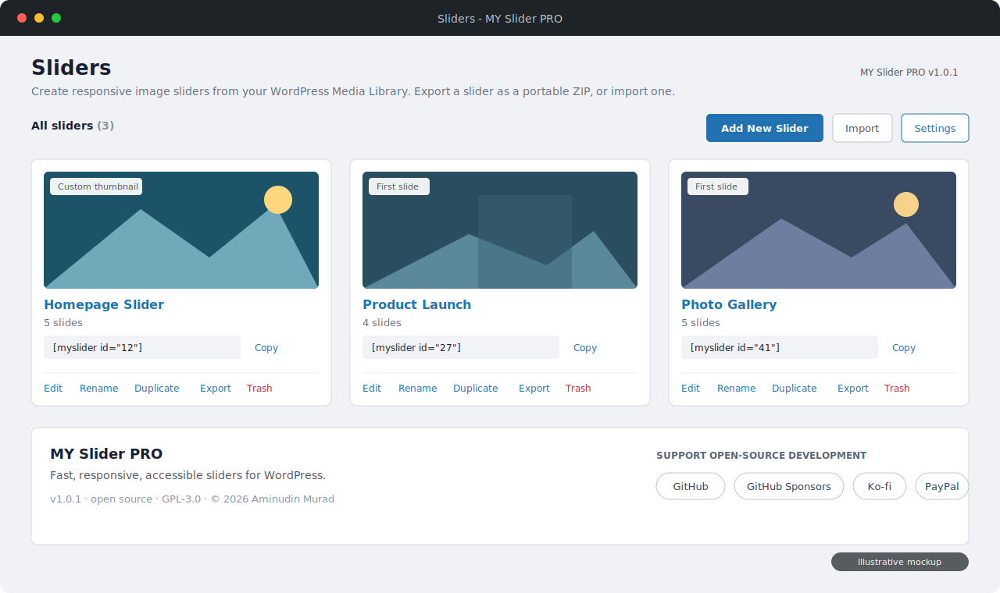
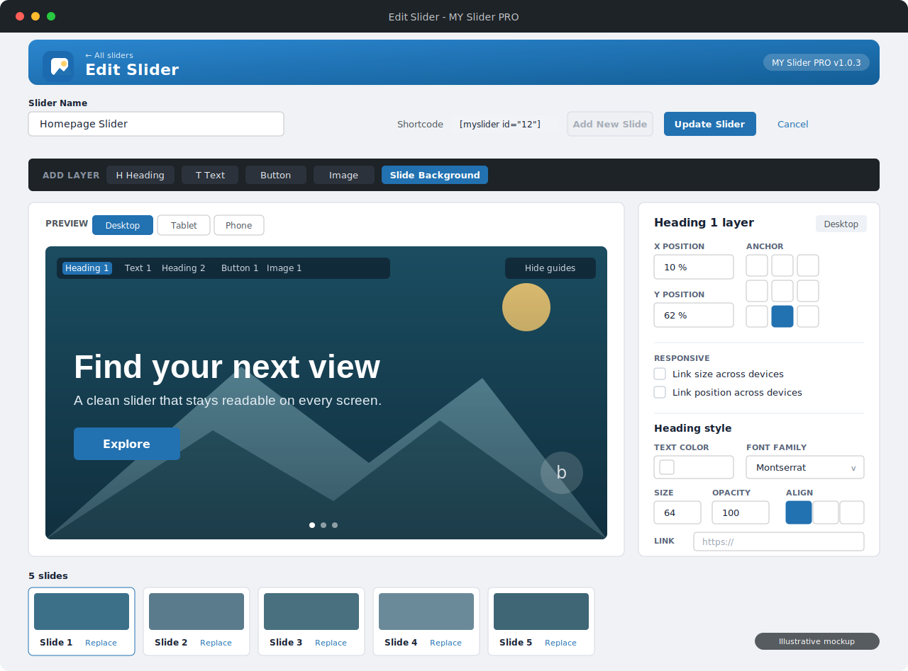
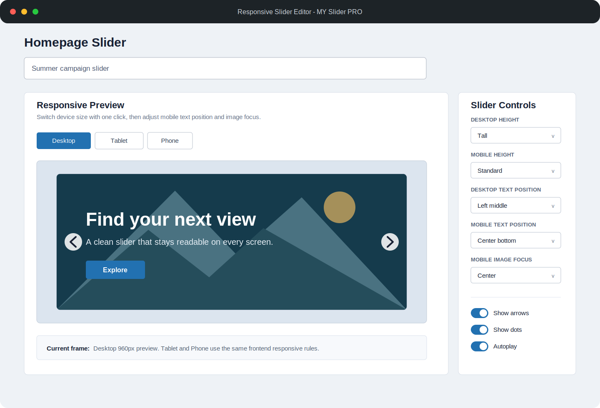
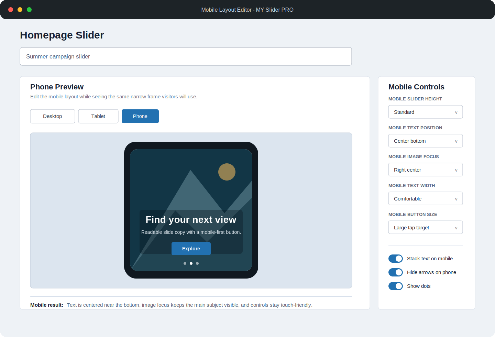

# MY Slider PRO

MY Slider PRO is a modern, open-source slider plugin for WordPress. This repository contains the plugin code and small, dependency-free local verification tools.

The current build focuses on responsive sliders: a card-grid slider library, canvas-first layer editing, independent Heading/Text/Button/Image layers, per-slide backgrounds with solid or gradient overlays, Full-width or Boxed layouts, per-layer animations, and a live device preview inside WordPress.

[](LICENSE)

**MY Slider PRO is free and open source under the GNU General Public License v3.0. If it helps you build sliders, please consider supporting continued development and WordPress compatibility testing:**

[](https://github.com/sponsors/aminudinmurad)
[](https://ko-fi.com/aminudinmurad)
[](https://www.paypal.com/paypalme/aminudinmurad)

## Overview

MY Slider PRO lets photographers, creatives, and content-rich sites build
responsive website sliders straight from the native WordPress Media
Library, then place them anywhere with a single shortcode. Each slide can
have focused copy, a call to action, an optional image layer, and its own
image focal point while keeping WordPress responsive sources and alternative text.

## Latest Features

- **Card-grid slider library** — manage every slider from a visual card grid with an assignable per-slider thumbnail (or automatic first-slide fallback), slide counts, and copyable shortcodes.
- **Native Media Library workflow** — pick images in the familiar media modal; no re-uploading.
- **Canvas-first editing** — click a Heading, Text, or Button layer on the canvas to edit it in place. The sidebar is a focused Layer Inspector for position, styling, and animation; the sortable Layers list and global Slider Settings sit in full-width panels below the preview.
- **Responsive layer editor** — switch between Desktop, Tablet, and Phone frames while editing the real slide composition.
- **Independent layers** — position Heading, Text, Button, and Image layers separately with bounded X/Y controls, anchor presets, keyboard nudging, and magnetic drag snapping.
- **Front-to-back layer sorting** — drag whole layer rows to control the public z-index order for each slide.
- **Repeatable layers with sensible caps** — add up to two of each layer type per slide (Heading, Text, Button, Image), each numbered (Heading 1, Heading 2, …) with its own Desktop/Tablet/Phone position, styling, opacity, animation, and optional link. Add New Slide and the per-type Add layer buttons grey out at their caps (up to 5 slides per slider).
- **Per-layer opacity** — bounded 10–100% opacity controls for every layer, reflected live in the editor and on the public slider.
- **Layer links** — add optional URLs to any Heading, Text, Button, or Image layer.
- **Per-layer animation** — choose none, fade, slide, or zoom animations with layer-specific delay, duration, and easing controls.
- **Exact font families** — use theme default, Poppins, Montserrat, or Inter with matching font loading in the editor and frontend.
- **Per-slide styling** — style each layer independently with its own color, typography, size, alignment, and responsive position, plus CTA text/background colors, text size, corner radius, padding, image-layer width, opacity, and a matching live preview.
- **Per-slide backgrounds and overlays** — set a replaceable background image (from a panel control or the editor toolbar), fill mode (cover, fill, fit, or actual size), nine-point position, an optional grayscale filter, and a background overlay — None, Solid, or Gradient with colour, second colour, opacity, and direction — all reflected live in the editor and on the public slider.
- **Full-width or Boxed layout** — constrain the slider shell to a responsive maximum width, or let it span full width.
- **Tablet and mobile controls** — set tablet and phone height, content alignment, text width, CTA size, and phone-specific arrow hiding.
- **Accessible by default** — keyboard-operable ordering, real navigation buttons, slide dots, pause/resume control, reduced-motion support, and preserved image alt text.
- **Fast touch interaction** — CSS scroll-snap provides native swipe behavior without a large slider dependency.
- **Quick rename and duplicate** — rename a slider inline from the overview, or duplicate an existing slider (settings, slides, and layers) as a new draft, both protected by capability and nonce checks.
- **Portable import and export** — download any slider as a self-contained `.zip` (settings, slides, and bundled images) named after the slider, then import it on the same or another site; bundled images are sideloaded into the Media Library and every reference is remapped, with archive validation and zip-slip/zip-bomb guards.
- **Per-layer responsive linking** — keep a layer's size or position linked across devices, or unlink to set Desktop, Tablet, and Phone independently, from toggles in the Layer Inspector.
- **One shortcode** — `[myslider id="123"]`, with **one-click copy** from the admin and a screen-reader-friendly confirmation.
- **Container-responsive** — layouts adapt to narrow theme and page-builder regions, not just the viewport.
- **Safe multi-author use** — slider isolation, per-attachment access checks, capability + nonce protection, and bounded queries.
- **No dependencies** — WordPress-native code with a small first-party autoloader; no build step or third-party runtime packages.

## Preview

### Slider library

Card-grid overview with per-slider thumbnails, copyable shortcodes, and quick actions (edit, rename, duplicate, export, trash).



### Visual layer editor

Canvas-first editing with an ADD LAYER toolbar, numbered per-type layers, a per-slide background with solid or gradient overlays, and a live Layer Inspector.



### Responsive device preview



### Phone layout editor



### Responsive front-end slider


> Screenshots are illustrative mockups of the plugin interface.

## Requirements

- WordPress 6.5 or newer
- PHP 7.4 or newer

## Local development

```bash
git clone https://github.com/AminudinMurad/my-slider-pro.git
cd my-slider-pro
```

Symlink or copy the project into `wp-content/plugins/my-slider-pro`, then activate **MY Slider PRO** in WordPress.

Run the dependency-free syntax and smoke tests before publishing a change:

```bash
bash tools/check.sh
```

## Architecture principles

- WordPress APIs first, including the media library and block editor.
- Namespaced PHP with a small bootstrap and first-party autoloader.
- Output escaped late; input sanitized and authorized at every boundary.
- Assets loaded only where a slider needs them.
- Accessible, responsive markup that works without JavaScript where practical.
- Public hooks use the `my_slider_pro_` prefix.
- User data is preserved on uninstall until an explicit opt-in deletion setting exists.

Main files:

- `my-slider-pro.php` defines the plugin identity, version, and bootstrap constants.
- `src/AdminPage.php` provides capability- and nonce-protected slider management.
- `src/SliderPostType.php` stores slider titles, ordered attachment IDs, display settings, and per-slide content.
- `src/SliderShortcode.php` renders published sliders with responsive WordPress images.
- `src/Plugin.php` registers plugin services and lifecycle hooks.
- `assets/` contains first-party, screen-scoped admin and slider assets.

## Using the slider

1. Open **MY Slider PRO > Add Slider** in WordPress.
2. Name the slider and choose images from the Media Library.
3. Reorder slides with drag and drop or the keyboard-accessible arrow controls, then use the **ADD LAYER** toolbar to add Heading, Text, Button, and Image layers (up to two of each) or open **Slide Background** to set the background image and overlay.
4. Use the device preview to check Desktop, Tablet, and Phone layouts. Select a Heading, Text, Button, or Image layer directly on the canvas or the layer list, drag whole layer rows to set the front-to-back order, use the grid and safe-area guides, drag with magnetic snapping, enter precise X/Y values in the Layer Inspector, or choose an anchor preset. Each layer and device saves its position independently.
5. Set desktop, tablet, and mobile height, content alignment, text width, CTA sizing, slider width (full or boxed), background and overlay, and navigation behavior, then save and copy the generated shortcode:

```text
[myslider id="123"]
```

The shortcode renders responsive image markup through WordPress. Touch swipe and keyboard navigation are available without third-party runtime dependencies.

Only image attachments the current user is allowed to edit can be saved. Images attached to draft or private content may remain in a slider while a site is being built, but the public shortcode suppresses them until their effective WordPress status becomes published.

## Releases

Releases are built and verified locally from the intended MY Slider PRO source state. Run `bash tools/check.sh`, build only the files allowed by `.distignore`, verify the archive root and contents, then write the approved package to `releases/my-slider-pro-<version>.zip`.

The local releases folder is ignored by Git and excluded from package inputs. Git tags and GitHub Releases are created manually only after the package has passed the release checklist.

Version references must agree in:

- `my-slider-pro.php`
- `readme.txt` (`Stable tag`)
- the Git tag

## Originality and provenance

MY Slider PRO is independently designed and implemented. The plugin does not include source code, templates, interface assets, branding, or derivative materials from other slider products.

Official release archives contain only first-party MY Slider PRO files under the GNU General Public License v3.0. The plugin and its local test runner require no third-party dependency manager or runtime packages.

## Support development

MY Slider PRO is free to use. Optional tips and other support help fund continued development, WordPress and PHP compatibility testing, and new features:

- [GitHub Sponsors](https://github.com/sponsors/aminudinmurad) — recurring support
- [Ko-fi](https://ko-fi.com/aminudinmurad) — quick one-time support
- [PayPal](https://www.paypal.com/paypalme/aminudinmurad) — direct support

Thank you for helping keep MY Slider PRO improving and freely available.

## License

Copyright (C) 2026 Aminudin Murad. MY Slider PRO is released under the GNU General Public License v3.0 (GPL-3.0). See [LICENSE](LICENSE). You are free to use, study, modify, and redistribute the software — including commercially — provided that any distributed copies or derivative works remain under the GPL, retain the original copyright and license notices, and make their source code available.
